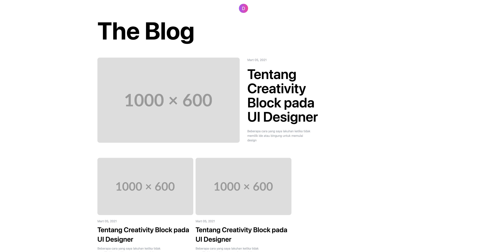

# Creating a Blog Page with NextJS and TailwindCSS

This is a simple blog page I created using NextJS and TailwindCSS.

## Screenshots



## Clone the repository
Follow the code below to clone the github project:

``` sh
git clone https://github.com/bekiryazgann/blog-page-front-end-with-next && cd blog-page-front-end-with-next
```


## Install the dependencies

Install the dependencies using the following command:

``` sh
pnpm install
```

## Usage

To start the development server, run the following command:

``` sh
pnpm dev
```

## Technologies Used

- NextJS
- TailwindCSS